## Chapter 2: Project Setup

In this chapter you will setup the project used for implementing Acron Heatng's SAP S/4HANA Cloud. For instance, you will create the actual project, define milestones, and staff the project.

[Step 1: ](Access Project Tile)

\(1\) Click  .

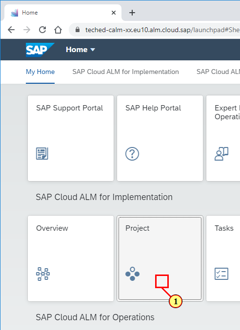

[Step 2: ](Create new project)

\(1\) Click  .

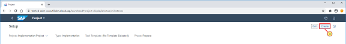

[Step 3: ](Maintain project data)

\(1\) Enter  **SAP S/4HANA Cloud &#64; Acron Heating Inc. \(&lt;Group&gt;\)**  with &lt;Group&gt; beein A or B as told by your instructor.

\(2\) Select  **SAP S/4HANA Cloud ** as Task Template.

\(3\) Click   as set  **Jan 4, 2021**  as End of Prepare Phase.

\(4\) Click   as set  **Feb 8, 2021**  as End of Explore Phase.

\(5\) Click   as set  **Mar 8, 2021**  as End of Realize Phase.

 

\(6\) Click   as set  **Apr 5, 2021**  as End of Deploy Phase.

 

\(7\) Click  as set  **Apr 6, 2021**  as Start of Production \(Run Phase\).

 

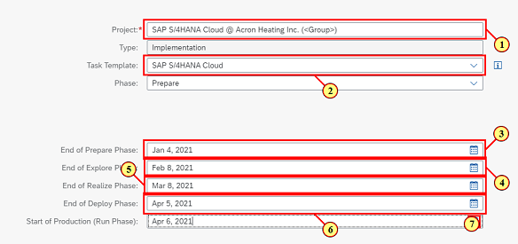

[Step 4: ](Save the project)

\(1\) Click  .

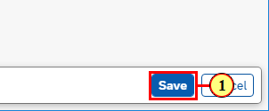

[Step 5: ](Switch to Team tab)

\(1\) Click  .

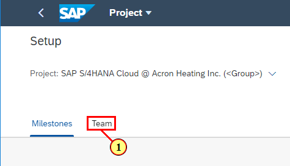

[Step 6: ](Toggle edit)

\(1\) Click  .

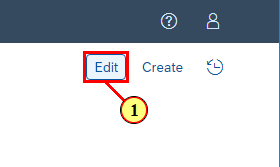

[Step 7: ](Maintain project team)

\(1\) Enter  **teched\-build&lt;xx&gt;**  as  **Project Lead**  with &lt;xx&gt; as your tenant number.

\(2\) Enter  **teched\-build&lt;xx&gt;**  as  **Business Process Expert**  with &lt;xx&gt; as your tenant number.

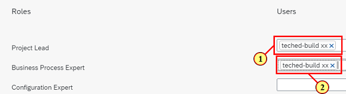

[Step 8: ](Save project team)

\(1\) Click  .

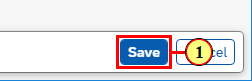

[Step 9: ](Back to Launchpad)

\(1\) Click   to get back to the launchpad.

[Step 10: ](Navigate to Overview tile)

\(1\) Click  .

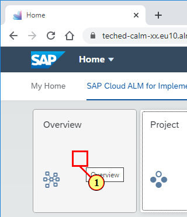

[Step 11: ](Navigate to task)

\(1\) Click  **Setup Project**  task.

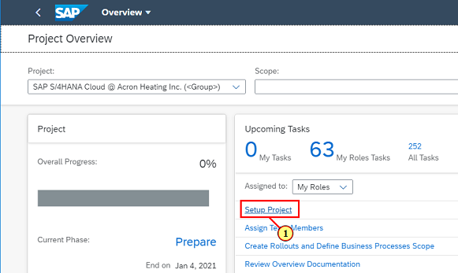

[Step 12: ](Set task to Done)

\(1\) Set task to  **Done** .

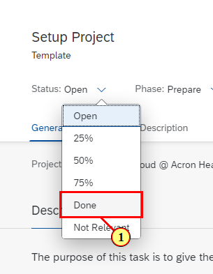

[Step 13: ](Navigate back to Overview page.)

\(1\) Click  .

Repeat steps 12 and 13 with task "Assign Team Members".

 

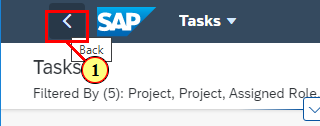

