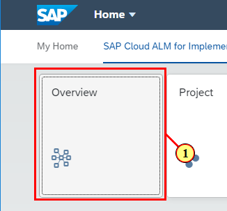
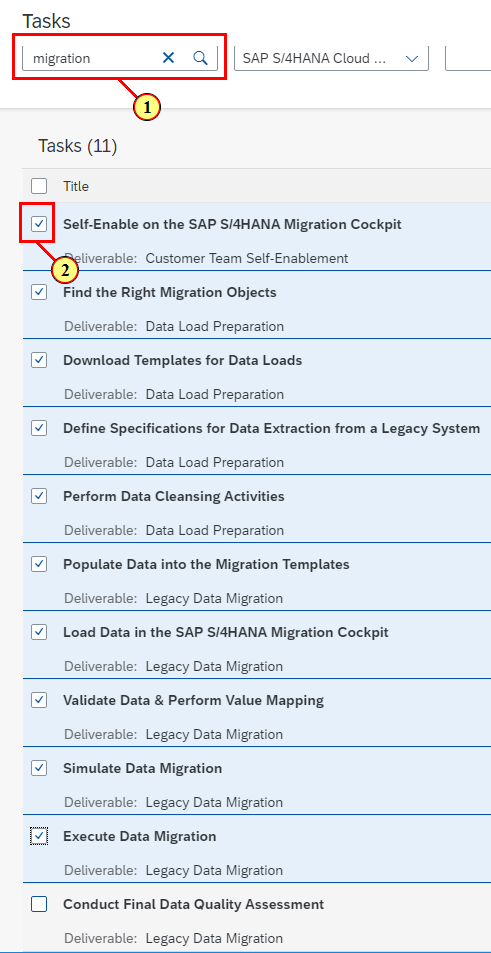
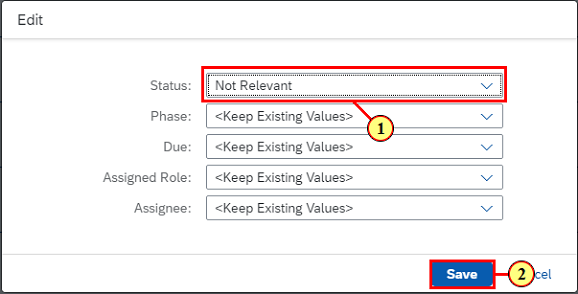
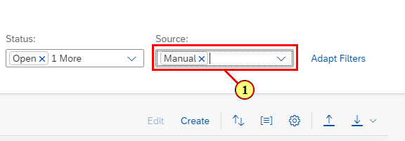

## Chapter 4: Review and Adjust Implementation Roadmap

At project setup you choose a SAP S/4HANA Cloud Roadmap as project tempalte. As some of the tasks may not be needed and other might be missing, you will be adjusting the roadmap by setting not needed taks to bsolete and creating missing tasks.

[Step 1: ](Navigate to Overview tile)

\(1\) Click  **Overview**  tile.

[Step 2: ](Navigate to task list)

\(1\) Click  **Upcoming Tasks**  to navigate to task list.

[Step 3: ](Find all migration tasks)

\(1\) Search list for "migration" tasks.

\(2\) Click check all relevant tasks.

[Step 4: ](Trigger mass maintenance)

\(1\) Click  .

[Step 5: ](Set status)

\(1\) Setz status  .

\(2\) Click  .

[Step 6: ](Add manual task)

\(1\) Click  .

[Step 7: ](Maintain manual task properties)

\(1\) Enter  **Project Closing Party**  as title.

You can also adjust the other properties. For instance you can set a phase or assign a particular role.

 

\(2\) Enter  **Some good drinks and fingerfood\!**  as description.

\(3\) Click  .

[Step 8: ](Close task)

\(1\) Click   to close the task.

[Step 9: ](Tasks - Google Chrome)

\(1\) Set  for Source filter to find manual tasks only.

[Step 10: ](Tasks - Google Chrome)

\(1\) Click  .

[Step 11: ](Back to Launchpad)

\(1\) Click   to navigate back to the Launchpad.

