## Chapter 7: Prepare Test

Once changes have been implemented, it's time for proper manual testing \(for sure only for those parts, wehre you have no atomatic testing available\). In this chapter, you will create Test Cases and prepare a process for manual testing.

[Step 1: ](Open Test Preparation)

\(1\) Click  **Test Preparation** .

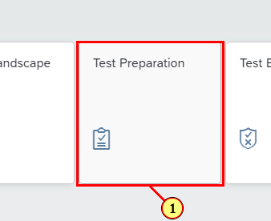

[Step 2: ](Open Process)

\(1\) Set  **Sales Processes France**  in Scope filter.

\(2\) Set  **Sell from Stock \(BD9\)**  in Business Process filter.

\(3\) Click on  **BD9 \- 01 \- Sell from Stock** .

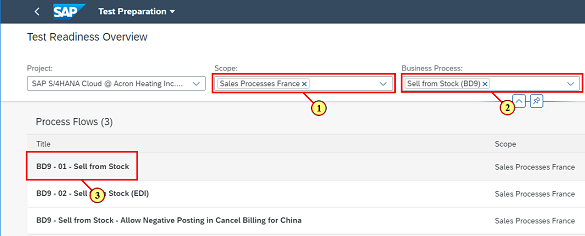

[Step 3: ](Create Test Case)

\(1\) Click   to create a new Test Case.

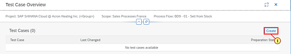

[Step 4: ](Set Test Case Scope)

\(1\) Click to add Solution Activity to Test Case scope.

\(2\) Click  .

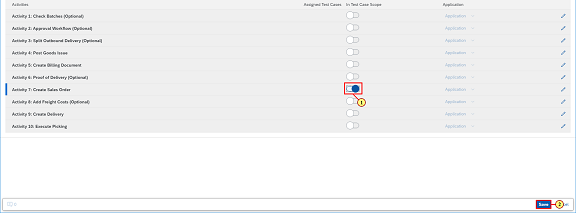

[Step 5: ](Toggle Edit)

\(1\) Click   to start editnig the Solution Action.

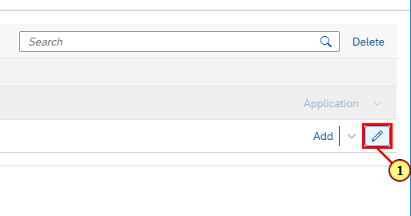

[Step 6: ](Maintain Solution Action)

\(1\) Enter  **Access the Sales order worklist**  as Title.

\(2\) Enter 

 **Open Manage Sales Orders.** 

 **Fro the menu, choose Tile Catalog Sales\-Sales Order Processing and Tile Manage Sales Orders.** 

as Instructions.

\(3\) Enter  **The Manage Sales Order screen displays**  as Expected Result.

\(4\) Click  .

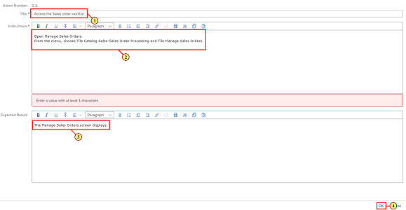

[Step 7: ](Add Solution Action)

\(1\) Click   to add another Solution Action.

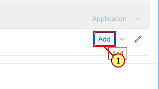

[Step 8: ](Maintain Solution Action)

\(1\) Enter  **Navigate to Create Sales Order Screen**  as Title.

\(2\) Enter  **On Manage Sales Orders screen, select the Create Sales Order button**  as Instruction.

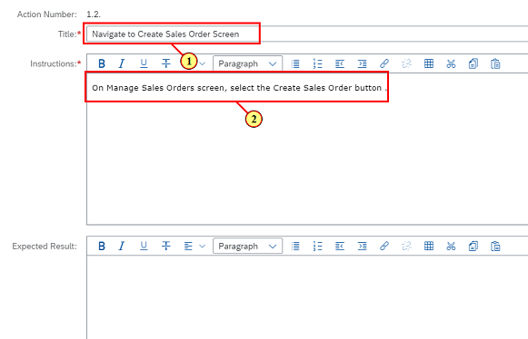

[Step 9: ](Save Solution Action)

\(1\) Click  .

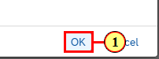

[Step 10: ](Add Solution Action)

\(1\) Click   to add one more Solution Action.

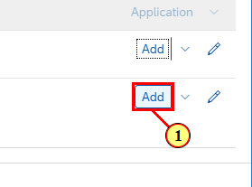

[Step 11: ](Maintain Solution Action)

\(1\) Enter  **Enter the Order type OR \(Standard Order\)**  as Title.

\(2\) Enter 

 **On the Create Sales Order: Initial Screen, make the following entries and choose Enter:** 

-   **Order Type: OR** 
-   **Sales Organization: 1210** 
-   **Distribution Channel: 10** 
-   **Division: 00 ** 

#

as Instructions.

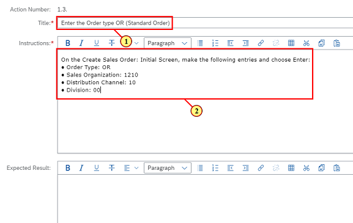

[Step 12: ](Save Solution Action)

\(1\) Click  .

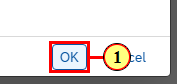

[Step 13: ](Add Solution Action)

\(1\) Click  .

[Step 14: ](Maintain Solution Action)

\(1\) Enter  **Enter Order Details**  as Title.

\(2\) Enter 

 **On the Create Stadnard Order: Overview screen, make the following entries:** 

-   **Sold to party: 12100003** 
-   **Ship to party: 12100003** 
-   **Cust. Reference: &lt;Reference number&gt;** 
-   **Material Number: &lt;Material number&gt;** 
-   **Quantity: &lt;Quantity&gt; e.g. 1 PC** 

#

 as Instructions.

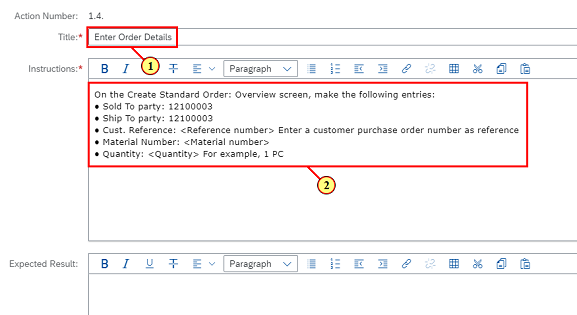

[Step 15: ](Save Solution Action)

\(1\) Click  .

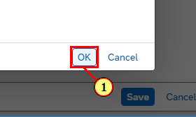

[Step 16: ](Add Solution Action)

\(1\) Click  .

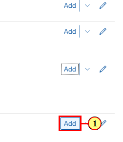

[Step 17: ](Maintain Solution Action)

\(1\) Enter  **Save Document**  as Title.

\(2\) Enter  **Choose Save Document. Make a note of the sales order number: \_\_\_\_\_\_\_\_\_\_**  as Instructions.

\(3\) Enter  **The order is saved and the order confirmation is printed out.**  as Expected Result.

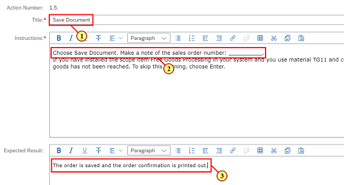

[Step 18: ](Save Test Case)

\(1\) Click  .

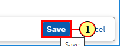

[Step 19: ](Set Test Case Prepared)

\(1\) Set Test Case status to  **Test Case Prepared** .

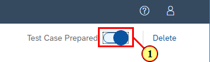

[Step 20: ](Save Test Case)

\(1\) Click  .

[Step 21: ](Open Launchpad)

\(1\) Navigate back to Launchpad.

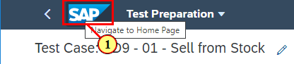

[Step 22: ](Open Test Preparation)

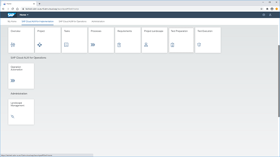

[Step 23: ](Set Test Readiness)

\(1\) Set  **Sales Processes France**  in Scope filter.

\(2\) Set  **Sell from Stock \(BD9\)**  in Business Process filter.

\(3\) Set Test Case Test Readiness.

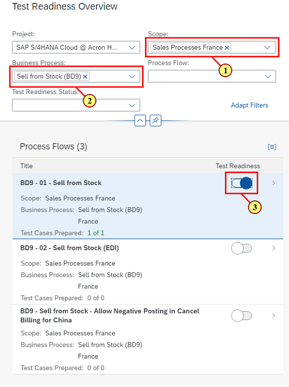

[Step 24: ](Open Launchpad)

\(1\) Navigate back to Launchpad.

