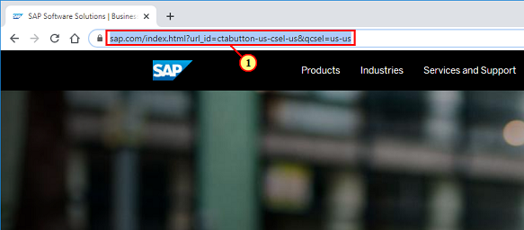
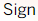
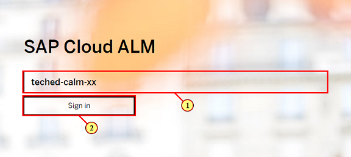
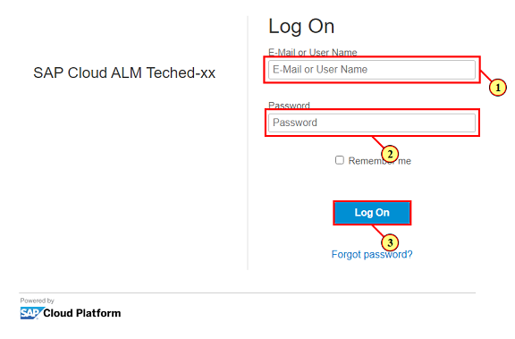
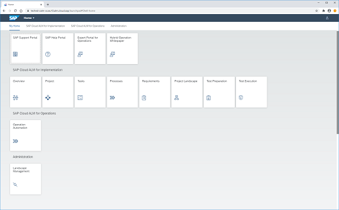

## Chapter 1: Onboarding

First, you need to access your SAP Cloud ALM tenant. This chapter will show how you can access your tenant to be used in this workshop. Please use the tenants during this workshop only. There will be multiple workshops running on the same tenants.

### Step 1: Access http://alm.cloud.sap

\(1\) Enter  **alm.cloud.sap**  in the adress bar.

### Step 2: Access your SAP Cloud ALM tenant

\(1\) Enter "teched\-calm\-&lt;xx&gt;" with your tenant number replacing &lt;xx&gt;.

\(2\) Click  .

### Step 3: Logon to the tenant

\(1\) Enter "teched\-build&lt;xx&gt;" with your tenant number replacing &lt;xx&gt;.

\(2\) Enter "Teched\-build&lt;xx&gt;" with your tenant number replacing &lt;xx&gt;\.\.

\(3\) Click  .

### Step 4: Welcome!

 **Congatulations\!** 

You succesfully accessed your SAP Cloud ALM tenant.

 

