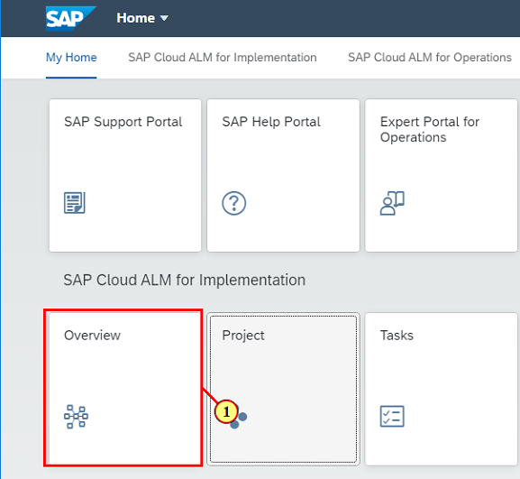
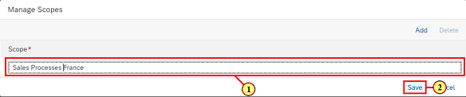

## Chapter 3: Define Process Scope

This chapter will guide you trough the definition of a Scope holding the processes \(Scope Items\) needed in Acon Heating's french subsidary. You will filter processes by country version, and assign processes to the project scope.

### Step 1: Access Overview tile

\(1\) Click the tile  **Overview.** 

### Step 2: Navigate to scope task

\(1\) Click  .

### Step 3: Start process list

\(1\) Click   to start process list.

### Step 4: Toggle edit mode

\(1\) Click  .

### Step 5: Open Manage Scopes dialog

\(1\) Click  .

### Step 6: Add new Scope

\(1\) Enter  **Sales Processes France**  in the text field.

\(2\) Click  .

### Step 7: Set process list filter values

\(1\) Set  **Sales Processes France**  in Scope filter.

\(2\) Set  **France** in Country/Region filter.

\(3\) Set  **SAP Best Practices for SAP S/4 HANA Cloud** in Solution Scenario filter.

### Step 8: Add processes to scope

\(1\) Enter  **BD9**  in the search field.

\(2\) Click   to set process in scope.

Beside BD9 please also add the processes BD6, BKK, J59 and BKP.

 

### Step 9: Conclude scoping mode

\(1\) Click  .

### Step 10: Check process scope

Check that you set all five processes in scope.

 

### Step 11: Processes - Google Chrome

\(1\) Click  . to navigate to the Launchpad.

### Step 12: Navigate to Overview tile

\(1\) Click  **Overview** .

### Step 13: Open task

\(1\) Click  .

### Step 14: Set task done

\(1\) Click  .

### Step 15: Navigate back to Overview page

\(1\) Click  .

### Step 16: Review phase and navigate to project setup

\(1\) Click on the phase in the Project tile.

### Step 17: Toggle edit mode

\(1\) Click  .

### Step 18: Change project phase

\(1\) Set project phase to  **Explore** .

\(2\) Click  .

### Step 19: Navigate back to Overview page

\(1\) Click  .

### Step 20: Review project phase

Check that current phase is  **Explore** .

 

