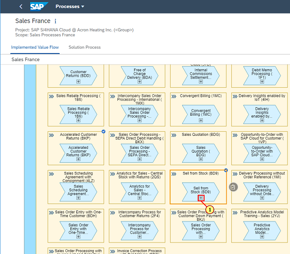
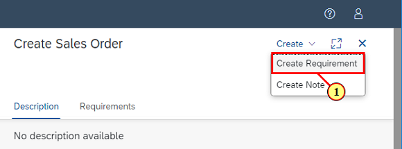
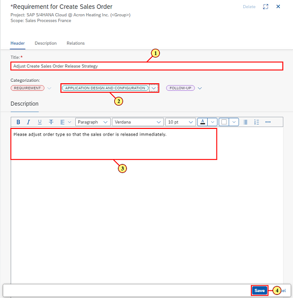
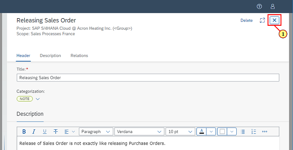
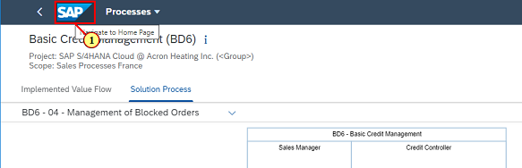

## Chapter 5: Conduct Fit\-to\-Standard Workshops

Fit\-to\-Standard workshops are at the heart of every cloud implementation project. In the workshops you will meet with the business departments and demo SAP's best practice processes. You will capture business requirements for needed adjustments, and notes to add additional knowledge or insights.

[Step 1: ](Navigate to Overview page)

\(1\) Click  **Overview** .

[Step 2: ](Open Upcoming Tasks)

\(1\) Click  **Upcoming Tasks** .

[Step 3: ](Set Task Status)

\(1\) Set the scope you created earlier in the Scope filter.

\(2\) Find task  **Schedule Fit to Standard**  and set it to  **Done** .

[Step 4: ](Open Application)

\(1\) Find task  **Conduct Fit to Standard**  and click  .

[Step 5: ](Open Process)

\(1\) Find process  **Sell from Stock \(BD9\)**  and navigate to the process details.

[Step 6: ](Open Process Flow)

\(1\)  

Click   to navigate to  **Sell from Stock \(BD9\)**  process flow.

 

[Step 7: ](Review Solution Activity)

\(1\) Review process flow and click  .

[Step 8: ](Create Requirement)

\(1\) Click   to create a requirement for Create Sales Order.

[Step 9: ](Maintain Requirement)

\(1\) Enter  **Adjust  Create Sales Order Release Strategy**  as requirement title.

\(2\) Set  as Workstream.

\(3\) Enter  **Please adjust order type so that the sales order is released immediately. ** as description.

\(4\) Click  .

[Step 10: ](Create Note)

\(1\) Make sure Create Sales Order is marked and then click .

[Step 11: ](Maintain Note)

\(1\) Enter  **Releasing Sales Order**  in the  text field.

\(2\) Enter  **Release of Sales Order is not exactly like releasing Purchase Orders.** 

 **Release of Sales Order is not exactly like releasing Purchase Orders.** 

as description

\(3\) Click  .

[Step 12: ](Close Note)

Check the requirement and note are visible in the side panel.

 

\(1\) Click   the side panel.

[Step 13: ](Open Sub-Process)

\(1\) Find  **Credit Management \(BD6\)**  and click   to navigate to the process flow of the related process.

[Step 14: ](Navigate to Launchpad)

\(1\) Click   to navigate back to Launchpad.

[Step 15: ](Open Task List)

\(1\) Click  **Tasks**  to navigate to Task List.

[Step 16: ](Set Task Status)

\(1\) Click   in Scope filter.

\(2\) Find task  **Conduct Fit to Standard**  and click  .

\(3\) Navigate back to Launchpad.

