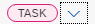
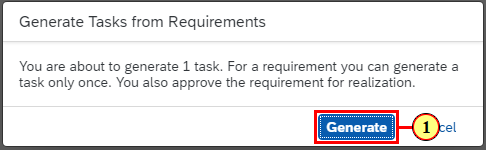
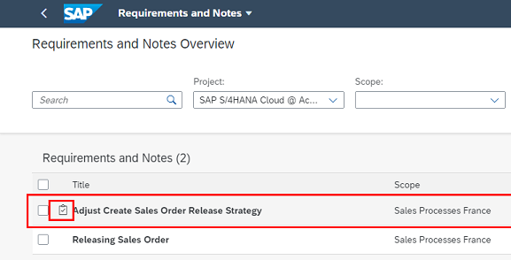
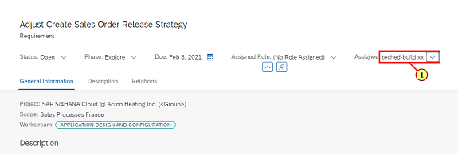
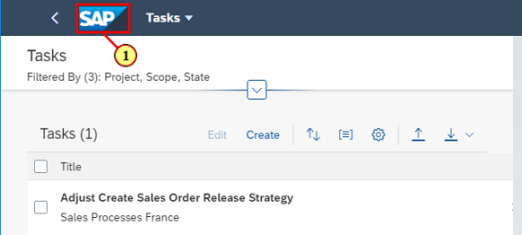
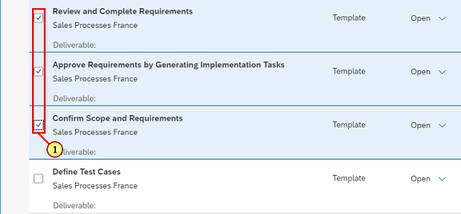
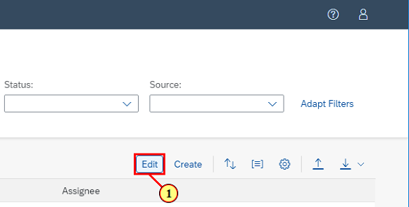

## Chapter 6: Finalize and Approve Requirements

After conducting Fit\-to\-Standard workshops, you will review, complete, and approve requirements to drive the implementation further. In this chapter you will learn how to complete requirements, and approve them  in order to create tasks that can be assigned to project team members.

### Step 1: Open Overview Page

\(1\) Click  **Overview.** 

### Step 2: Open Upcoming Tasks

\(1\) Click  **Upcoming Tasks** .

### Step 3: Open Application

\(1\)  

Find  **Review and Complete Requirements**  task and click  .

 

### Step 4: Open Requirement

\(1\) Open requirement  **Adjust Create Sales Order Release Strategy** .

### Step 5: Maintain Requirement

\(1\) Add test  **Check "Release Immediately" for Order Type "OR"**  into the description box.

\(2\) Set requirement follow\-up to  .

\(3\) Click  .

### Step 6: Mark Requirement

\(1\) Check checkbox for requirement  **Adjust Create Sales Order Release Strategy** .

### Step 7: Generate Task

\(1\) Click  .

### Step 8: Confirm Task Generation

\(1\) Click  .

### Step 9: Open Requirement

A task icon appears in front of the requirement after successful task genenration.

 

\(1\) Open requirement  **Adjust Create Sales Order Strategy** .

### Step 10: Navigate to Generated Task

The link behind "Task" allows you to navigate to the generated task.

The link behind "Business Process" allows you to navigate to the origin of the linked requirement.

 

\(1\) Navigate to the generated Task.

### Step 11: Open Launchpad

\(1\) Set   \(your user\) as Assignee.

### Step 12: Tasks - Google Chrome

\(1\)  **Navigate back to Launchpad**  by clicking on the SAP logo.

### Step 13: Display Launchpad

\(1\) Click the  **Tasks**  tile to navigate to the task list.

### Step 14: Tasks - Google Chrome

\(1\) Find and check checkboxes for  **Review and Complete Requirements,**  **Approve Requirements by Generating Implementation Tasks**  and  **Confirm Scope and Requirements** .

### Step 15: Tasks - Google Chrome

\(1\) Click  .

### Step 16: Tasks - Google Chrome

\(1\) Set status to  **Done** .

\(2\) Click  .

### Step 17: Tasks - Google Chrome

\(1\)  **Navigate back to Launchpad** by clicking the SAP logo.

