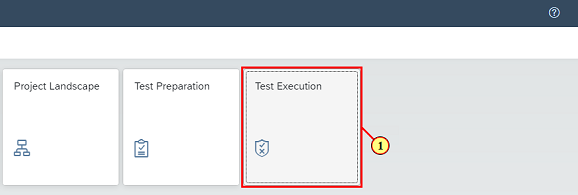
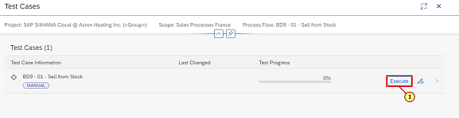

[Back](/README.md)

---

## Chapter 8: Execute Test

Last but not least, in this chapter, you will conduct a test run to test the processes you prepared before. You will execute a test case and you will capture the test result.

### Step 1: Open Test Execution

\(1\) Click the  **Test Execution** tile.

### Step 2: Open Process

\(1\) Open test for  **BD9 \- 01 \- Sell from Stock** .

### Step 3: Start Test Execution

\(1\) Click  .

### Step 4: Set Test Result

\(1\) Set Solution Actions 1.1 and 1.2 to  **Pass** .

\(2\) Click  **entry 1.3**  to open the comment section.

### Step 5: Set Test Result

\(1\) Set Solution Action 1.3 to  **Pass with Reservations** .

\(2\) Enter  **Recheck values**  as Comment.

\(3\) Click   to close the comment section.

### Step 6: Set Test Result

\(1\) Set Solution Actions 1.4 and 1.5 to  **Pass** .

\(2\) Click  .

### Step 7: Close Test Run

\(1\) Click  .

### Step 8: Open Launchpad

\(1\) Navigate back to Launchpad by clicking the SAP logo.

### Step 9: Open Overview Page

\(1\) Navigate to  **Overview** page.

### Step 10: Reveiw Project Progress

Congratulations, you made some progress and you concluded your SAP TechEd Session on SAP Cloud ALM successfully\!

 

---

[Back](/README.md)

